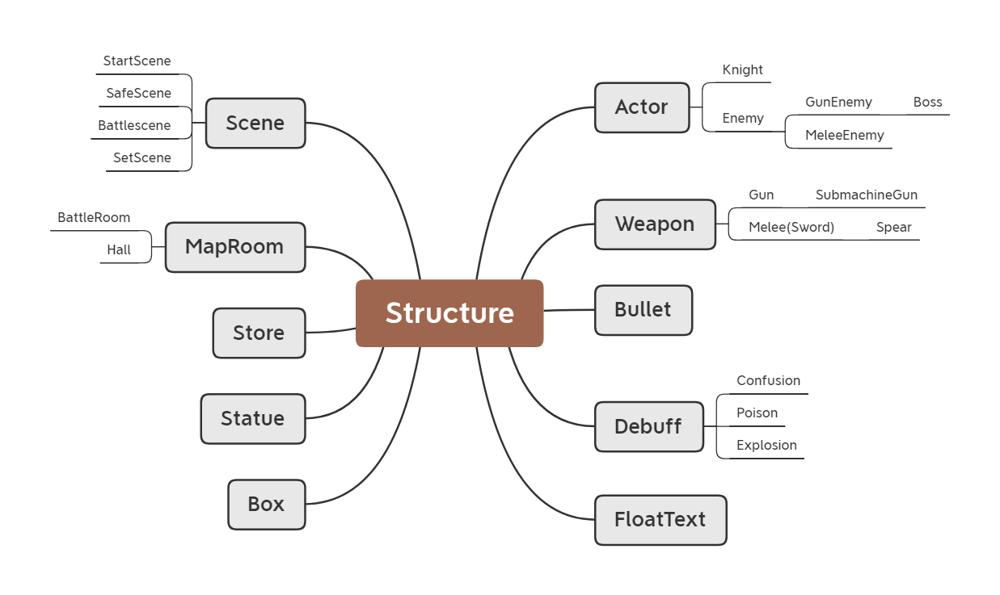
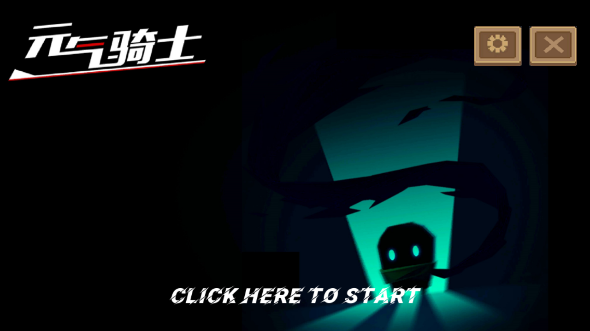
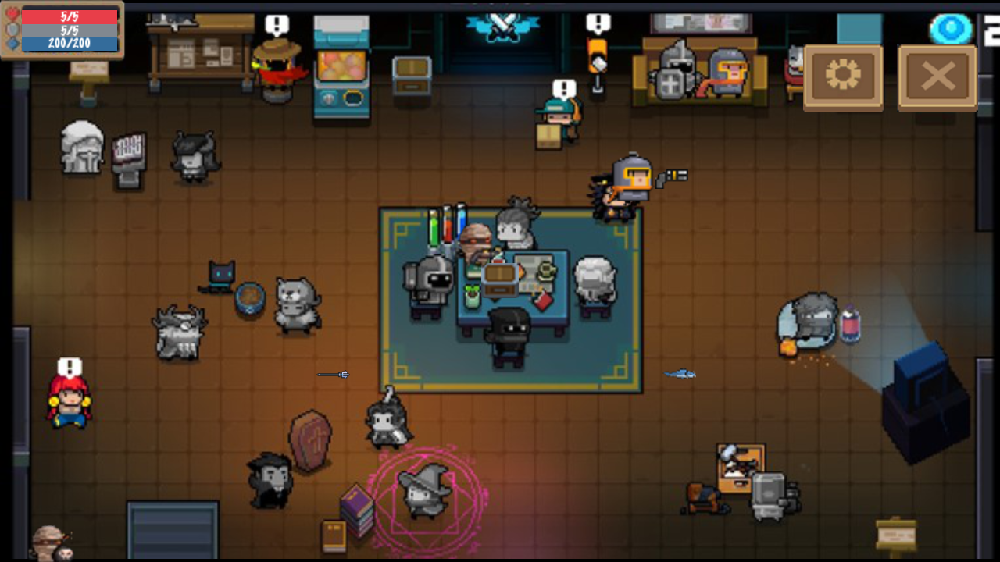
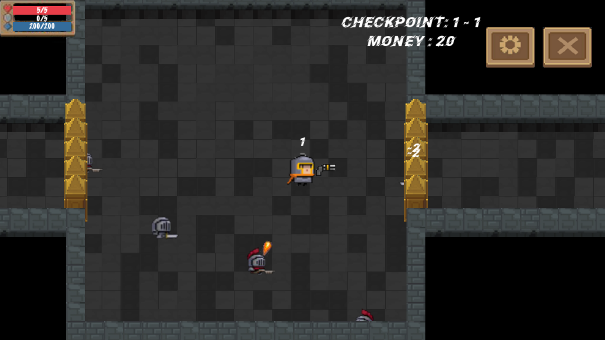

# Soul_Knight_Reproduction Document

> 同济大学2021年高级语言程序设计课程大项目

## 项目信息

- 项目选题：元气骑士
- 游戏引擎：__cocos2d-x v4.x__
- 班级：周一赵老师班

* 项目成员 & 贡献比

|  姓名  |  学号   |                             分工                             | 贡献比 |
| :----: | :-----: | :----------------------------------------------------------: | :----: |
| 方必诚 | 2052329 | 开始场景、安全场景的搭建，骑士、敌人、子弹、武器类的架构及基本实现 |  36%   |
| 王林飞 | 2051739 | 设置场景的搭建，bgm、音效控制的实现，宝箱、药水、雕像、商店的实现 |  33%   |
| 何有强 | 2051624 | 战斗场景的搭建，子弹的自动瞄准，关卡、边界判断、子弹碰撞的实现 |  30%   |

* 项目地址

  [点击链接][https://github.com/Baokker/Soul_Knight_Reproduction]

* 进度

  | 日期  |                             进展                             |
  | :---: | :----------------------------------------------------------: |
  | 4.22  |               确定选题为“元气骑士”，并确定组员               |
  | 4.25  |            全员安装cocos2dx，学习Git，注册GitHub             |
  | 5.1~7 |                  学习cocos2dx，阅读相关教程                  |
  |  5.7  |                           搜集素材                           |
  |  5.8  |                         确定大致分工                         |
  | 5.14  |          完成StartScene，基本完成创造单间BattleRoom          |
  | 5.17  |                完成SafeScene架构，初步加入BGM                |
  | 5.24  | 实现WASD键盘控制Knight移动,建立Setscene，初步实现了菜单功能  |
  | 5.25  |            完成整个地图的生成，初步实现地图的移动            |
  | 5.26  |            初步实现Weapon类，初步实现了box,props             |
  | 5.30  |            初步实现Bullet类，实现了BGM的音量控制             |
  |  6.1  |                初步实现在地图内走动的边界判断                |
  |  6.3  |            重新设计Knight Enemy Weapon Bullet架构            |
  |  6.5  |              实现Knight的Die功能，加入了Statue               |
  |  6.8  |               初步实现Knight和Enemy的近战功能                |
  |  6.9  |              初步实现切换武器，初步实现金币系统              |
  | 6.12  |     子弹的瞄准和与敌人的碰撞判定，子弹的部分边界碰撞判定     |
  | 6.14  | 初步实现Enemy AI功能，实现状态栏和护盾回复，实现FLoatText，雕像 |
  | 6.15  |                         合并三人代码                         |
  | 6.16  | 实现近战武器具体化（Spear） 射击武器具体化（submachinegun），金币系统，boss初步构建 |
  | 6.17  | 实现boss的瞬移，中毒、混乱、爆炸等debuff，实现武器CD机制，加入了音效及其控制 |
  | 6.18  | 进一步完善敌人AI 修复bug，加入了Store、goods，实现了完成一关后进入下一关 |
  | 每天  |                         修复各种bug                          |
  
  

## 项目开发

1. 架构设计

   - 

* 难点及解决
  1. （方必诚）类的架构问题。起初我们将Sprite作为Knight、Enemy等Class的component（一个private成员），这在后来的代码实践中被证明过于冗余，且不甚符合面向对象的概念。最终我决定重写类的架构，这才使得代码逐渐变得富有条理。例如Actor继承了Sprite，而Knight和Enemy继承了Actor，而Enemy下又细分为GunEnemy，MeleeEnemy（近战敌人）。
  2. （方必诚）WASD实现移动的过程对于刚接触cocos2dx的小白来说简直如同噩梦。在经过大量查阅以及咨询后，最终得出的最佳方案是：通过键盘监听器检测按键的按下松开，对knight的MoveSpeed进行相应设置，进而在Scene或Knight自身里设置Update函数，将knight位置设为getPosition()+MoveSpeed，再调用ScheduleUpdate每帧调用update。
  3. （王林飞）cocos2dx4.0的声音与音效功能和之前版本有较大差异，很难实现声音的管理，以及通过滑动条实现对音量的控制，当时由于对这一系统的了解过少，所以做起来感觉较为困难。后来通过设置全局静态变量解决了滑动条拖动时经常卡顿的问题，并通过在Startscene传参实现在Setscene中控制audio的播放。
  4. （王林飞）一开始不太熟悉schedule、scheduleOnce等函数的运用，因此在实现计时、定时功能是有较大的困难，在做护盾自动回复时较为难办。后来通过合理运用Update更新的频率以及两个时间变量的差值实现了一定程度上的计时，因为频率会在一定范围内变化，致使计时仍然不是完全准确，但误差较小，可以接受。
  5. （何有强）地图开始时的生成逻辑一开始计划直接计算坐标来整个生成，但这样对于后续的不同类型的房间设置和后续功能实现不利。后来通过先在一个二维数组里设置地图本身，再遍历这个地图在对应的位置添加元素。设置了基类MapRoom，并由BattleRoom和Hall来继承MapRoom来将地图分成不同的BattleRoom和Hall，将其进行连接来完成整个地图的生成和连接，这在后期设置不同类型房间时派上了用场。
  6. （何有强）由于我们希望的效果是移动时人始终在屏幕中心，因此在BattleScene中的移动其实是整个地图的相对移动。在参考了在SafeScene中的人物移动方式后，也选择了在Scene里添加update函数。由于地图随机生成的需要，地图上的每一个元素都是单独生成的，这对于整体移动是个麻烦的问题，最后通过遍历BattleScene中的各个BattleRoom和Hall来完成整体的移动。

## 亮点

1. 通过灵活运用schedule、scheduleOnce等函数，将许多功能集合进对象本身，符合OOP编程理念。例如，角色的武器自动跟随，骑士的方向会随运动方向而改变，骑士可以自动恢复护盾，所有Debuff机制在传入Knight*后都可以进行自动绑定。
2. 地图的随机生成
3. Boss关卡的设计（在n-5关卡之中）
4. debuff的设计，包括减速，混乱，中毒，爆炸

## 基本项

> 引自《2021 高级程序设计 期末项目说明》

- [x] 游戏开始界面、背景音乐、音量控制、暂停及恢复功能、退出功能
- [x] 键盘控制
- [x] 至少2类武器，包括不限于枪械类武器、近战武器；
- [x] 每类武器至少包括2种具体的武器，如枪械类武器包括不限于一次发射单发子弹的枪械、一次发射多发子弹枪械等，近战武器包括不限于可快速攻击的小范围武器、攻击速度较慢的⼤范围武器等
- [x] 至少2种普通敌人类型，包括不限于近战型敌人和远程型敌人；每类普通敌人至少包括2类具体的敌⼈
- [x] 至少两种道具，包括不限于恢复生命、增加护甲的道具，可以通过击败敌人获取宝箱机制，开启可获得新武器或者道具等
- [x] 安全地图与探险地图，安全地图指进入关卡前的地图，可以查看武器信息、敌人信息等，探险地图
- [x] 关卡中主角死亡，探险终止并返回安全地图
- [x] 至少包括2个关卡

## 加分项

- [x] C++特性的运用：
  * auto变量/vector的遍历/lambda 函数/函数指针
- [x] debuff机制（包括Poison（每秒扣1血），Confusion（角色会往相反方向行进），Explosion，Slowdown（减速））
- [x] 每次进入相同关卡都会随机出不同地图
- [x] 金币机制，击败敌人可获取金币，用于商店和雕像
- [x] Boss的设置（每5关出现一次）
- [x] 商店、雕像、宝箱的设置

## 运行截图

* 
* 

- 

